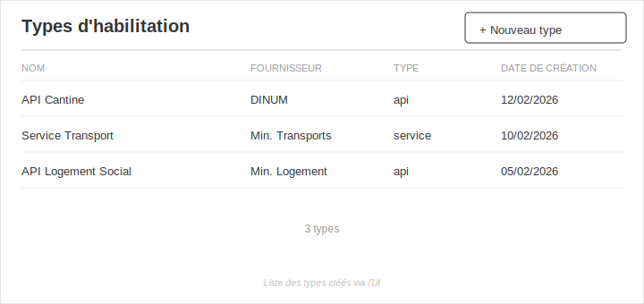
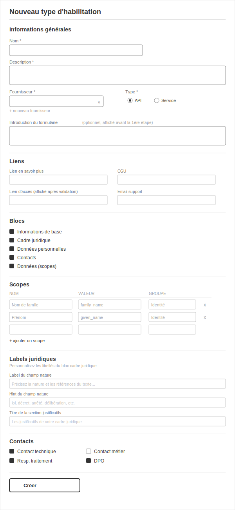

# Création de types d'habilitation dans l'UI — Shaping

**Vocabulaire** : On appelera dans ce document "Types d'habilitation" ou "types" ce qui dans le code s'appelle une "authorization definition". Par exemple, `api_particulier`, `annuaire_des_entreprises` sont des types d'habilitation. On peut aussi dire que c'est la classe d'une demande, genre `AuthorizationRequest::APIParticulier` ou `AuthorizationRequest::AnnuaireDesEntreprises`.

## Frame

### Source

> Aujourd'hui, la création d'un nouveau type d'habilitation se fait comme ça :
> 
> 
> 
> CF [cette documentation](https://github.com/etalab/data_pass/blob/develop/docs/nouveau_type_d_habilitation.md).
>
> J'aimerais proposer une nouvelle fonctionnalité pour DataPass : « Création de
> nouveaux types d'habilitation dans l'UI ». Elle permettrait de créer de nouveaux
> types d'habilitation sans avoir à modifier le code.
>
> L'objectif est de simplifier la création de nouveaux types d'habilitation pour
> notre équipe, car aujourd'hui, cette opération nécessite trop de connaissances techniques.
> Je souhaite qu'en RDV bizdev on puisse créer de nouveaux types d'habilitation sans avoir
> à faire appel à l'équipe technique.
>
> Cette fonctionnalité serait disponible dans le panneau d'administration et
> permettrait de créer un nouveau type d'habilitation à l'aide d'un builder.
> Accessible uniquement aux admins.
>
> L'objectif est également de poser les premières briques pour permettre un jour à
> nos fournisseurs de données de créer leur propres types d'habilitation en autonomie.
> 
> 
> 
> Ouais, y'a du taf. Donc on va déjà commencer par se permettre à nous-même de créer des types d'habilitations via l'UI, pour raffiner le besoin via notre propre usage.

### Problem

Creating a new authorization type requires a developer to: modify YAML config,
create a Ruby model, add views, configure I18n, and write tests. The bizdev team
is blocked by the tech team for what is essentially a configuration task. There
are 55+ types, and each has followed   this same manual 6-step process.

> _Me when I create a new habilitation type, have hair and am a bit fatter_
> 
> 

### Outcome

The bizdev team can create new authorization types autonomously through the admin
panel, without any code change or deployment.

> 

---

## Requirements (R)

| ID | Requirement | Status |
|----|-------------|--------|
| **R0** | Bizdev can create new authorization types without developer intervention | Core goal |
| **R1** | New type configuration stored in DB, not YAML | Must-have |
| **R2** | Existing YAML-based types NOT migrated to DB | Must-have |
| **R3** | Both YAML-based and DB-based types work transparently through existing models; extend existing mechanism, limit impact | Must-have |
| **R4** | Creation UI in admin panel, admin-only; UI can be rough, backend must be solid | Must-have |
| **R5** | Blocks individually selectable; all optional, all included by default | Must-have |
| **R6** | New type auto-generates associated « demande libre » form | Must-have |
| **R7** | Bizdev can create a new DataProvider and use it for a new type | Must-have |
| **R7.1** | Bizdev can create a new DataProvider from the same UI flow | Nice-to-have |
| **R7.2** | Created Providers can have a logo  | Nice-to-have |
| **R8** | Types can be edited and deleted from the admin UI | Must-have |
| **R9** | Backend keeps the door open for future provider self-service | Nice-to-have |
| **R10** | Roles can be assigned to users for the DB-created types | Must-have |

### R8 sub-requirements (type lifecycle)

| ID | Requirement | Status |
|----|-------------|--------|
| **R8.1** | Types with no requests: freely editable and deletable | Must-have |
| **R8.1.1** | Edit and delete should be possible in development, sandbox & staging even if there is existing requests or authorizations (we can destroy them) : this is to allow tests and iterations for the bizdev | Must-have |
| **R8.1.2** | Edit and delete should be possible in production if there is no request or authorization | Must-have |
| **R8.2** | If we don't want to have environment-specific behaviors : Editing or deletion a type **with requests** requires explicit confirmation showing request count and affected organizations (cascade delete of all requests before applying the change) | Nice-to-have |
| **R8.2.1** | Confirmation dialog disables the confirm button for 5 seconds to prevent accidental destructive actions | Nice-to-have |

### R5 sub-requirements (block behaviors)

| ID | Requirement | Status |
|----|-------------|--------|
| **R5.1** | **basic_infos** — always includes intitule + description, both required | Must-have |
| **R5.2** | **legal** — always includes cadre_juridique_nature (required), cadre_juridique_url OR cadre_juridique_document (one required). Bizdev can customize labels (initialized with defaults): nature field label, nature hint, document field label | Must-have |
| **R5.3** | **personal_data** — always includes destinataire, durée conservation (required), justification if > 36 months | Must-have |
| **R5.4** | **contacts** — bizdev picks from predefined list: contact_technique, contact_metier, responsable_traitement, delegue_protection_donnees. GDPR contacts are optional, not forced | Must-have |
| **R5.5** | **scopes** — simplified config (name/value/group). At least one scope must be selected by applicant | Must-have |
| **R5.6** | **UI behavior** — unchecking a block disables and hides its configuration section (contacts, scopes, legal labels). Values filled before unchecking are ignored on submit. | Must-have |

### R6 sub-requirements

| ID | Requirement | Status |
|----|-------------|--------|
| **R6.1** | Form steps auto-derived from selected blocks in a fixed order | Must-have |
| **R6.2** | Optional introduction text is configurable | Must-have |

---

## Scope decisions

### Configurable by bizdev (in the creation UI)

| Field | Notes |
|-------|-------|
| `name` | Display name |
| `description` | Shown in index |
| `provider` | Select existing or create new DataProvider |
| `link` | URL to learn more |
| `cgu_link` | Terms of Service URL |
| `access_link` | URL shown in final authorization for applicant to get access |
| `support_email` | Support contact |
| `kind` | `api` or `service` |
| Blocks selection | basic_infos, legal, personal_data, contacts, scopes — checkboxes, all checked by default |
| Scopes | Simplified: name, value, group only (no deprecated/included/disabled) |
| Form introduction | Optional text before first step |

### Defaulted (not configurable for now)

| Field | Default | Notes |
|-------|---------|-------|
| `public` | `true` | Visible in public index |
| `unique` | `false` | Multiple authorizations per org allowed |
| `startable_by_applicant` | `true` | Stages are being removed |
| `features.messaging` | `true` | |
| `features.transfer` | `true` | |
| `features.reopening` | `true` | |
| `features.instructor_drafts` | `true` | Changed from current default (false) |
| Form name | From definition name | |
| Form description | From definition description | |
| Form steps | Auto from selected blocks, fixed order | |
| `scopes_config` | All scopes shown and enabled | |

### Out of scope

| Field | Reason |
|-------|--------|
| `stage` (sandbox/production) | Being removed entirely this year |
| `static_blocks` | Not relevant for demande libre |
| `initialize_with` | Not relevant for demande libre |
| `use_case` | Not relevant for demande libre |
| `service_provider_id` | Not relevant for demande libre |
| `single_page_view` | Not relevant — using standard multi-step wizard |

---

## CURRENT: How it works today

| Part | Mechanism |
|------|-----------|
| **CUR1** | **AuthorizationDefinition** — `StaticApplicationRecord` loaded from YAML (`config/authorization_definitions/*.yml`). In-memory, no DB. |
| **CUR2** | **AuthorizationRequestForm** — `StaticApplicationRecord` loaded from YAML (`config/authorization_request_forms/*.yml`). In-memory, no DB. |
| **CUR3** | **AuthorizationRequest** — DB model with STI (Single Table Inheritance). References definition via class name (`to_s.demodulize.underscore`), form via `form_uid` column. |
| **CUR4** | **Ruby model per type** — Each type has `app/models/authorization_request/<type>.rb` with concerns (BasicInfos, CadreJuridique, PersonalData, Contacts, Scopes). |
| **CUR5** | **I18n** — Labels, hints, titles configured in `authorization_request_forms.fr.yml` and `activerecord.fr.yml`. |
| **CUR6** | **Views** — Block partials in `app/views/authorization_request_forms/build/` and `app/views/authorization_requests/blocks/`. Custom overrides possible per definition or form. |
| **CUR7** | **DataProvider** — DB model (migrated from YAML in PR #1175). Referenced by `provider` field in definition. |

### Key coupling points

- `AuthorizationRequest` subclass name must match definition UID
- `StaticApplicationRecord` assumes all records come from YAML
- Block concerns (BasicInfos, etc.) are Ruby modules included in model classes
- Views resolve partials by definition ID, then form UID, then default

---

## Shape A: Hybrid Lookup + Metaprogrammed Classes

| Part | Mechanism | Flag |
|------|-----------|:----:|
| **A1** | **Hybrid backend** — No new base class needed. Override `backend` in `AuthorizationDefinition` and `AuthorizationRequestForm` to return YAML records + DB records merged. DB records are wrapped into the same object (`AuthorizationDefinition.new(...)`) via a `build_from_record` method. All consumers see identical objects. Add `reset!` to bust `@all` cache when new types are created. | |
| **A2** | **DB tables** — `authorization_definition_records` table stores definition config (name, description, provider_id, kind, blocks as jsonb, scopes as jsonb, contact_types as jsonb, features as jsonb, links, emails, custom labels as jsonb). `authorization_request_form_records` table stores form config (steps as jsonb, introduction). Backed by `AuthorizationDefinitionRecord` and `AuthorizationRequestFormRecord` ActiveRecord models. | |
| **A3** | **Dynamic class generation** — `DynamicAuthorizationTypeRegistrar` service. At boot (`to_prepare`), loads all DB definitions and for each: creates `Class.new(AuthorizationRequest)`, dynamically includes the right concerns based on block config, registers with `const_set(uid.classify, klass)`. On admin creation, registers immediately + calls `reset!`. `to_prepare` handles dev reloading (runs on every request) and production boot. | |
| **A4** | **I18n from DB** — Custom labels stored in `custom_labels` jsonb column on `AuthorizationDefinitionRecord`. Single change: add a `custom_label_for` check as "level 0" in `wording_for` (the form builder method all labels flow through). DB labels checked first, then existing I18n cascade continues. YAML types unaffected (custom_labels is nil). | |
| **A5** | **Admin builder UI** — Form in admin panel. Fields: name, description, provider (select or create new), link, cgu_link, access_link, support_email, kind. Block checkboxes (all checked by default). Contact type selection (when contacts block is active). Scopes builder (add/remove rows with name/value/group). Legal label customization. Form introduction text. | |
| **A6** | **DataProvider inline creation** — A "create new provider" option in the provider dropdown. Since DataProvider is already a DB model (PR #1175), this is a simple nested form or modal. |
| **A7** | **Type lifecycle (edit/delete)** — No requests: edit freely (pre-filled form), delete freely. With requests: both edit and delete trigger the same confirmation page showing request count + sample organization names (up to 3 + « etc... »). Message: « Cette action va SUPPRIMER N DEMANDES. Ces demandes proviennent (entre autres) de ORG1, ORG2, ORG3, etc... Êtes vous sûrs, super sûrs de vouloir faire ça ? ». Confirm button is disabled for 5 seconds (countdown) to prevent accidental clicks. On confirm: cascade-destroy all requests + authorizations, then apply edit or delete. This sidesteps versioning entirely — no need to reconcile old requests with new config. | | |

### Resolved unknowns (from spikes)

**A1 — Hybrid backend (spike completed):**
- No new base class needed — override `backend` in each model
- DB records are wrapped into the same `AuthorizationDefinition` objects
- All query methods (`find`, `where`, `exists?`) go through `all` → no consumer changes
- Cache invalidation via `reset!` method on `StaticApplicationRecord`
- UID uniqueness validated across both YAML and DB sources
- See [spike-A1-hybrid-application-record.md](./spike-A1-hybrid-application-record.md) for full details

**A3 — Dynamic class generation (spike completed):**
- Rails STI resolves dynamic classes correctly via `constantize`
- `const_set` assigns `name` automatically — `definition` resolution works as-is
- Concerns (BasicInfos, CadreJuridique, etc.) can be included dynamically on
  `Class.new` subclasses — class instance variables are per-class
- `to_prepare` handles dev reloading and production boot
- Runtime registration works for the creating process; other workers pick up on restart
- Class names follow `uid.classify` convention (uses existing inflection rules)
- See [spike-A3-dynamic-class-generation.md](./spike-A3-dynamic-class-generation.md) for full details

**A4 — I18n from DB (spike completed):**
- No custom I18n backend needed — single method change in `AuthorizationRequestFormBuilder`
- `wording_for` gets a "level 0" check: `custom_label_for(key)` before the 3-level I18n cascade
- `custom_labels` jsonb column on `AuthorizationDefinitionRecord`, exposed as attr on `AuthorizationDefinition`
- YAML types unaffected (custom_labels is nil → falls through)
- `label_value` and `hint_for` both go through `wording_for` → automatically covered
- See [spike-A4-i18n-from-db.md](./spike-A4-i18n-from-db.md) for full details

---

## Fit Check: R × A

| Req | Requirement | Status | A |
|-----|-------------|--------|---|
| R0 | Bizdev can create new authorization types without developer intervention | Core goal | ✅ |
| R1 | New type configuration stored in DB, not YAML | Must-have | ✅ |
| R2 | Existing YAML-based types NOT migrated to DB | Must-have | ✅ |
| R3 | Both YAML-based and DB-based types work transparently; extend existing mechanism, limit impact | Must-have | ✅ |
| R4 | Creation UI in admin panel, admin-only; UI can be rough, backend must be solid | Must-have | ✅ |
| R5 | Blocks individually selectable; all optional, all included by default | Must-have | ✅ |
| R5.2 | Legal block: bizdev can customize labels (initialized with defaults) | Must-have | ✅ |
| R5.6 | Unchecking a block disables/hides its section; filled values ignored on submit | Must-have | ✅ |
| R6 | New type auto-generates associated « demande libre » form | Must-have | ✅ |
| R7 | Bizdev can create a new DataProvider from the same UI flow | Must-have | ✅ |
| R8 | Types can be edited and deleted from the admin UI | Must-have | ✅ |
| R8.1 | Types with no requests: freely editable and deletable | Must-have | ✅ |
| R8.2 | Types with requests: edit or delete triggers confirmation with count + orgs, cascade delete before applying | Must-have | ✅ |
| R8.3 | Confirmation dialog disables confirm button for 5 seconds | Must-have | ✅ |
| R9 | Backend keeps the door open for future provider self-service | Nice-to-have | ✅ |

**All requirements pass.** R8 is fully handled by A7 (Type lifecycle): free edit/delete when no requests, cascade-delete + confirmation when requests exist — same flow for both edit and delete, which sidesteps the versioning problem entirely. All three spikes (A1, A3, A4) resolved with low-to-medium risk mechanisms. A7 requires no spike — standard Rails CRUD + cascade delete + 5s countdown.

---

## Slices

Shape A is selected and fully validated. See [slices doc](./create_new_authorizations%20-%20slices.md) for the implementation breakdown:

| Slice | What it delivers |
|-------|-----------------|
| **V1** | End-to-end proof: admin creates a minimal type (basic_infos only), edits/deletes it, applicant fills it, instructor reviews |
| **V2** | Block selection + scopes builder + contacts configuration + destructive edit/delete with confirmation |
| **V3** | Full configuration: links, custom legal labels, provider creation, introduction text |

## Wireframes

### Liste des types

### Formulaire de création / édition

### Gestion des fournisseurs

---

## Quelques memes en vrac pour conclure

