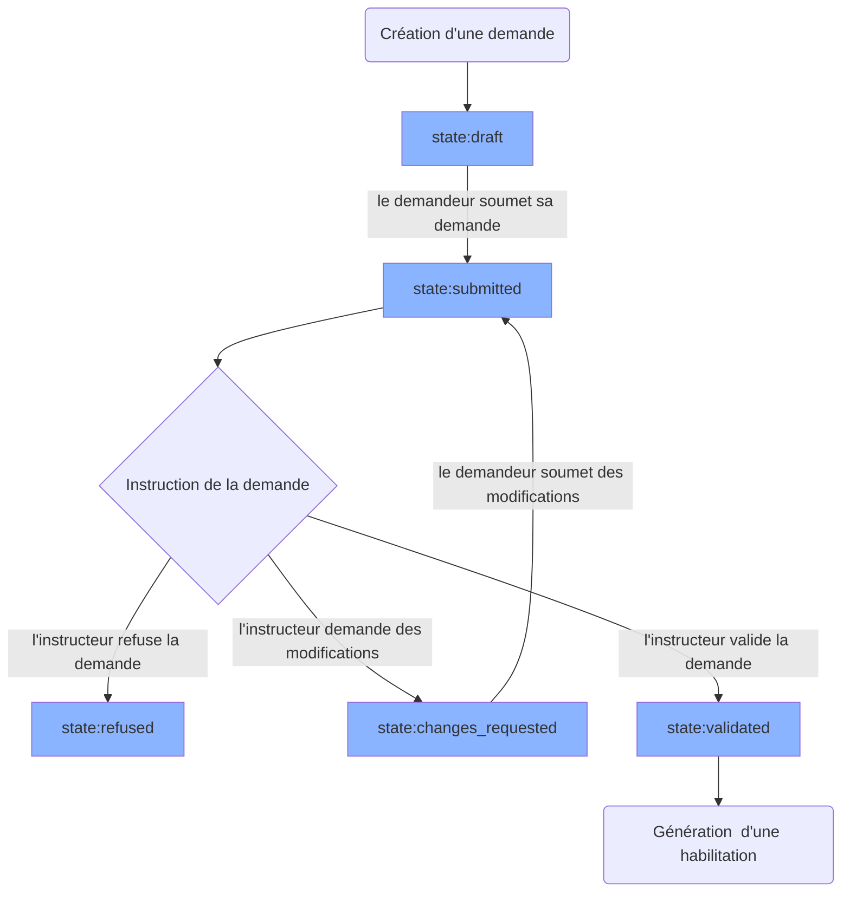
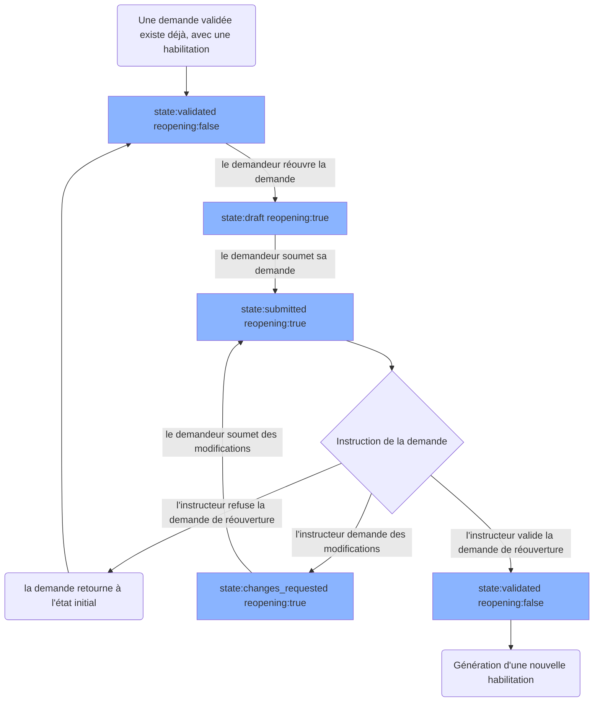
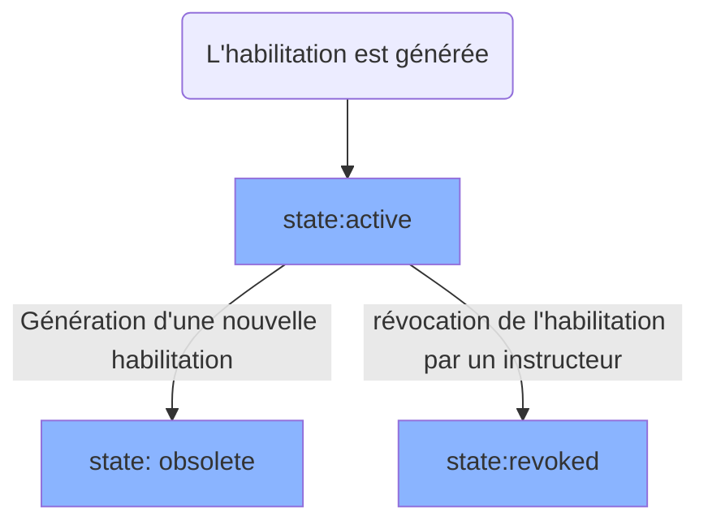

# Cycle de vie d'une Demande

## Cas d'une demande initiale

Voici le cycle de vie basique d'une demande.

Une demande peut être archivée par l'instructeur ou le demandeur (si elle n'a aucune habilitation active), dans ce cas le status devient <code>archived</code>, et elle ne sera plus visible dans DataPass.

## Cas d'une réouverture

Une demande est dite en "réouverture" lorsqu'elle a déjà une habilitation, et que le demandeur la soumet à nouveau pour apporter des changements à l'habilitation qui lui a été délivrée.

Un paramètre booléen `reopening` représente l'état de réouverture d'une demande.

Voici le cycle de vie d'une demande lorsqu'elle est réouverte.

Après la génération d'une nouvelle habilitation, la demande aura donc été en tout à l'origine de 2 habilitations.

# Status d'une Habilitation

Une habilitation commence son existence `state:active`. Si une nouvelle habilitation est générée suite à une réouverture de sa demande, l'ancienne habilitation devient `state:obsolete`.

Une habilitation peut aussi être révoquée par un instructeur, devenant donc `state:revoked`.

