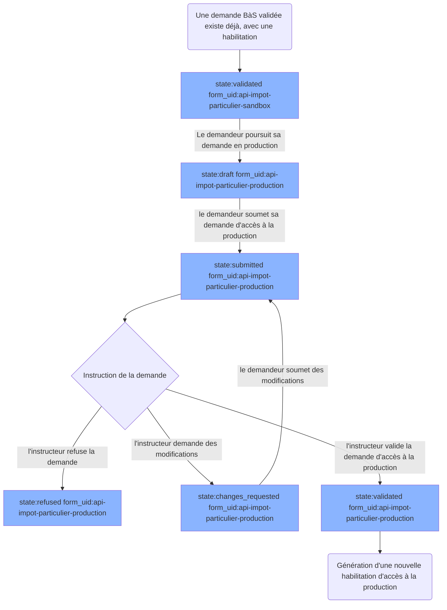

# Cycle de vie d'une Demande avec stages

Une demande avec stages c'est typiquement une demande qui doit passer par 2 étapes d'instructions : une première étape pour habiliter l'accès à un `Bac à Sable`, une seconde étape pour habiliter l'accès à la `Production`. Aujourd'hui, cela ne concerne que les habilitations de la DGFiP.

## Cas d'une demande initiale d'accès en bac à sable

Tout se passe comme pour une demande d'accès "classique".

> [Voir le cycle de vie classique d'une demande sans stages](./lifecycle_documentation.md)

## Cas d'une réouverture d'une demande d'accès en bac à sable

Tout se passe comme pour une demande d'accès "classique".

> [Voir le cycle de vie classique d'une demande sans stages](./lifecycle_documentation.md)

## Cas d'une demande d'accès en production

A la suite d'une demande d'accès en bac à sable (BàS) validée, le demandeur peut poursuivre sa demande pour obtenir un accès en production.

A ce moment là, la demande est transformée pour changer de `type` et de `form_uid`. Elle conserve néanmoins ses données remplies lors de la demande de Bac à Sable, ainsi que l'habilitation de bac à sable précédemment générée.

Le demandeur va remplir les champs supplémentaires décrits par le formulaire d'accès à la production, et re-soumettre sa demande qui repassera par le cycle de vie "classique".

## Cas d'une réouverture 

**Si le de demadeur réouvre sa demande à partir de l'habilitation de Production** : La demande suivra le cycle de réouverture "classique".

**Si le demandeur réouvre sa demande à partir de l'habilitation de BàS** : La demande change de `type` et de `form_uid` pour redevenir une demande de Bac à Sable, qui suivra le cycle de réouverture "classique". Suite à une validation par un instructeur, le demandeur pourra poursuivre sa demande en production, qui suivra le cycle de demande de production "classique".

