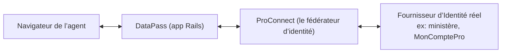
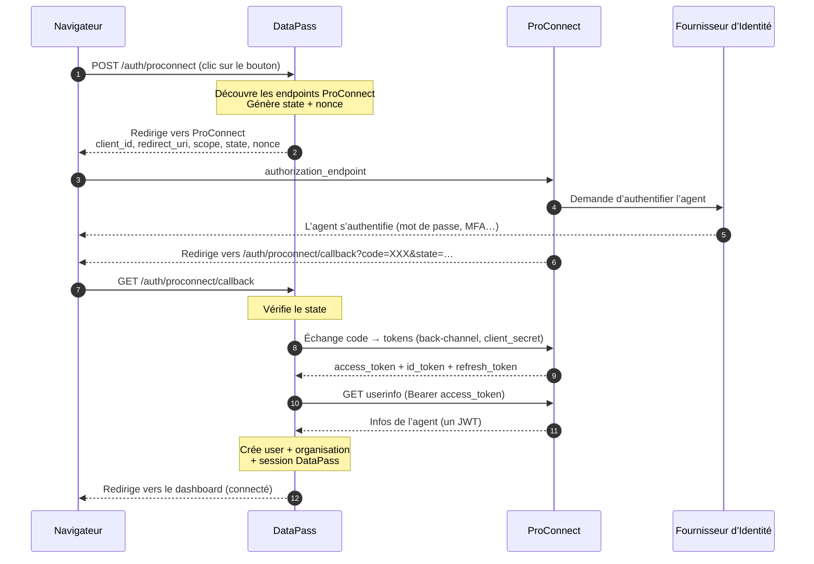
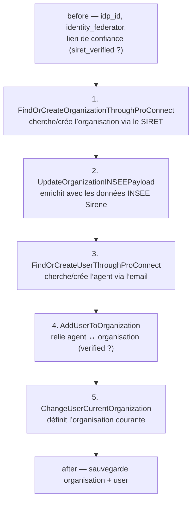
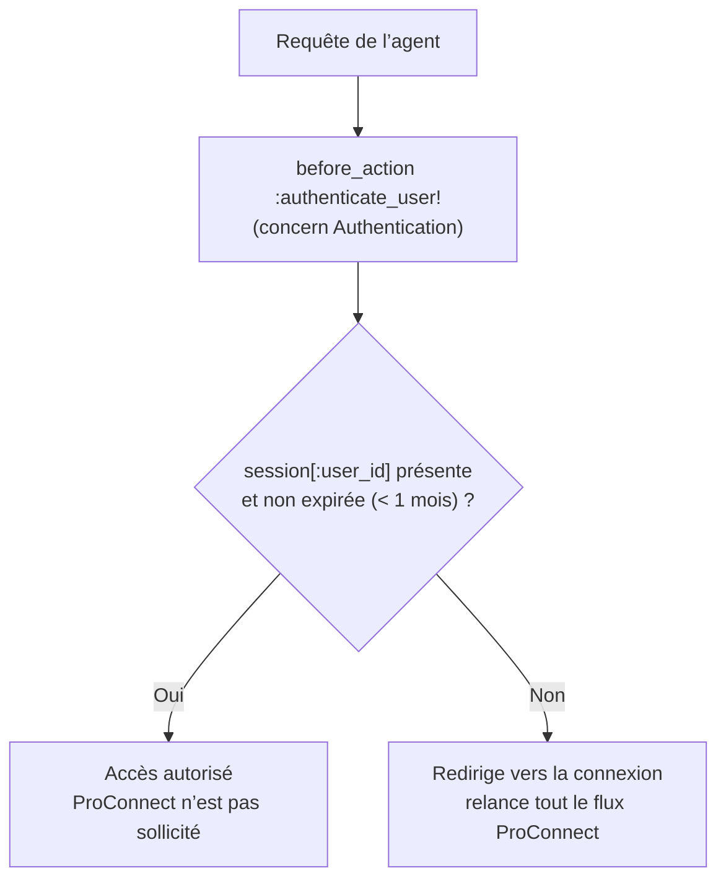
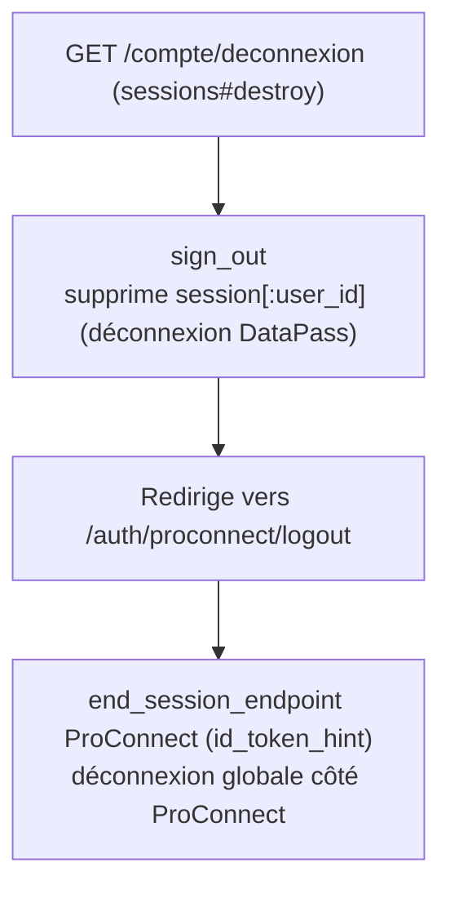

# Authentification des agents via ProConnect

Ce document décrit le processus complet d’authentification d’un agent sur DataPass.
Il couvre le flux ProConnect (actuel), la chaîne de traitement côté DataPass, la gestion
de session, la déconnexion, les mécanismes de sécurité, et le provider legacy MonComptePro.

> Ce document se lit à deux niveaux. La section **« Le principe en bref »** ci-dessous donne
> une vue d’ensemble accessible sans connaissance technique. Les sections suivantes entrent
> dans le détail du code et s’adressent aux développeurs. Un **glossaire** est disponible en
> fin de page.

## Le principe en bref

DataPass ne gère pas lui-même l’authentification des agents : il la délègue entièrement à
ProConnect. ProConnect joue le rôle de fédérateur d’identité — une porte d’entrée unique qui
s’appuie, selon l’agent, sur le fournisseur d’identité adéquat (l’annuaire de son ministère,
ProConnect-Identité pour les agents sans annuaire dédié, etc.), choisi d’après le domaine de
son email.

Le déroulé est le suivant :

- L’agent demande à se connecter à DataPass, qui le redirige vers ProConnect.
- ProConnect vérifie son identité auprès du bon fournisseur. Lorsque ce fournisseur impose une
  double authentification, DataPass s’assure qu’elle a bien eu lieu et la réclame activement si
  ProConnect ne l’a pas déjà appliquée. DataPass ne voit jamais le mot de passe de l’agent.
- Une fois l’agent authentifié, ProConnect renvoie à DataPass une preuve d’identité, que
  DataPass échange en arrière-plan contre les informations de l’agent : nom, email, et surtout
  le SIRET de l’organisation où il travaille.
- DataPass en déduit trois choses : qui est l’agent, dans quelle organisation il travaille, et
  si ce lien peut être considéré comme vérifié. Il ouvre alors une session valable un mois.
- Tant que cette session est valide, l’agent navigue dans DataPass sans repasser par
  ProConnect. À son expiration, ou après une déconnexion, le parcours complet recommence.

Les sections suivantes détaillent l’implémentation de ce parcours.

## Vue d’ensemble



Idée centrale : **DataPass ne gère aucun mot de passe.** Il délègue la preuve d’identité à
ProConnect, qui est un *fédérateur* : un seul bouton « ProConnect » côté DataPass, mais
plusieurs fournisseurs d’identité (FI) derrière (l’IdP d’un ministère, ProConnect-Identité
ex-MonComptePro pour les agents sans IdP dédié, etc.). ProConnect choisit le bon FI selon le
domaine de l’email de l’agent.

Le protocole est **OpenID Connect (OIDC)**, dans sa variante « Authorization Code Flow ».

## Première connexion



Étapes détaillées :

1. **Départ.** L’agent clique sur le bouton (`_pro_connect.html.erb` →
   `POST /auth/proconnect`). La gem `omniauth-proconnect` intercepte cette route. Elle
   interroge ProConnect pour découvrir ses endpoints (`discover_endpoint!` sur
   `.well-known/openid-configuration`), génère un `state` et un `nonce` stockés en session.
2. **Redirection.** La gem renvoie le navigateur vers l’`authorization_endpoint` de
   ProConnect avec `client_id`, `redirect_uri`, `scope`, `state`, `nonce`.
3. **Authentification chez ProConnect.** L’agent choisit son organisation, s’authentifie,
   fait éventuellement une double authentification. DataPass ne voit rien de cette étape.
4. **Retour avec un code.** ProConnect renvoie le navigateur vers
   `/auth/proconnect/callback` avec un `code` à usage unique et le `state`. DataPass vérifie
   d’abord que le `state` correspond à celui qu’il avait émis (`verify_state!`).
5. **Échange code → tokens (back-channel).** Le `code` seul est inutile. DataPass rappelle
   ProConnect **de serveur à serveur** (le navigateur n’est pas dans la boucle), avec son
   `client_secret`, pour échanger le code contre des tokens (`access_token`, `id_token`,
   `refresh_token`), stockés en session sous `omniauth.pc.*`.
6. **Récupération des infos agent.** DataPass appelle le `userinfo_endpoint` avec
   l’`access_token`. Particularité ProConnect : la réponse est un **JWT** (jeton signé), pas
   du JSON brut. Il est décodé dans `@userinfo`. Claims utiles : `sub` (identifiant unique),
   `email`, `given_name`, `usual_name`, `siret`, `idp_id` (quel FI a servi), `phone_number`.
7. **Construction côté DataPass.** Voir la section suivante.

## Traitement côté DataPass (étape 7)

Le `SessionsController#create` reçoit le callback OmniAuth, aiguille vers
`create_from_proconnect`, vérifie le MFA (voir plus bas), puis appelle l’organizer
`AuthenticateUserThroughProConnect` :



Trois objets distincts en sortent : **qui** est l’agent (User, via email), **où** il travaille
(Organization, via SIRET enrichi INSEE), et le **lien de confiance** entre les deux (`verified`
ou non, selon le FI).

Le controller appelle ensuite `sign_in`, qui crée la **session applicative DataPass** :

```ruby
session[:user_id] = {
  value: user.id,
  expires_at: 1.month.from_now,
  identity_federator:,
  identity_provider_uid:,
}
```

Enfin, si le FI a `choose_organization_on_sign_in?` à vrai (agent multi-organisations), DataPass
redirige vers la page de choix d’organisation (`user_organizations_path`). Sinon, direction le
dashboard.

## Connexions suivantes : ProConnect n’est plus sollicité



Une fois connecté, DataPass vit sur **sa propre session** (cookie, un mois). Il ne rappelle pas
ProConnect à chaque page. ProConnect ne sert qu’à prouver l’identité au moment du login.

Il y a donc **deux sessions distinctes** :

- les **tokens ProConnect** (`omniauth.pc.*`) — utilisés au login et conservés surtout pour la
  déconnexion globale ;
- la **session applicative DataPass** (`session[:user_id]`) — c’est elle qui maintient l’agent
  connecté pendant un mois.

## Mécanismes de sécurité

**Le `state` — éviter qu’une connexion soit détournée.**
Au moment d’envoyer l’agent vers ProConnect, DataPass génère un identifiant aléatoire propre à
cette tentative de connexion, le conserve dans la session et le transmet à ProConnect, qui le
renvoie inchangé. Au retour, DataPass vérifie que les deux correspondent (`verify_state!`). Sans
ce contrôle, un tiers pourrait forger une réponse d’authentification et la faire traiter par le
navigateur de la victime (attaque CSRF) ; le `state` garantit que la réponse traitée répond bien
à une demande émise depuis ce navigateur. En cas de différence, la connexion est rejetée.

**Le `nonce` — empêcher la réutilisation d’un ancien jeton.**
DataPass insère un second identifiant aléatoire dans la demande ; ProConnect le réinscrit à
l’intérieur de l’`id_token` qu’il délivre. DataPass vérifie ainsi que le jeton reçu a bien été
émis pour cette demande précise, et non rejoué à partir d’un échange antérieur intercepté. Là où
le `state` protège l’aller-retour de la requête, le `nonce` protège le contenu du jeton.

**Le MFA conditionnel — exiger la double authentification quand le fournisseur l’impose.**
(Ajouté en janvier 2026.) Certains fournisseurs d’identité imposent une authentification à deux
facteurs, mais ProConnect ne l’applique pas systématiquement. Au retour, DataPass lit dans
l’`id_token` le champ `amr` (`proconnect_id_token_amr`) — la liste des méthodes d’authentification
réellement employées. Si le fournisseur exige le MFA (`identity_provider.mfa_required?`) alors que
`amr` n’en porte pas la trace, DataPass relance une tentative ProConnect en réclamant explicitement
ce niveau de garantie (`authorization_uri_with_mfa`, qui force les valeurs attendues listées dans
`MFA_ACR_VALUES`). L’agent doit alors compléter sa double authentification avant d’accéder à
DataPass. C’est la partie la plus subtile de `config/initializers/omniauth.rb`.

> Repères : `amr` (*Authentication Methods References*) = les méthodes d’authentification
> employées ; `acr` (*Authentication Context Class Reference*) = le niveau de garantie atteint.

## Déconnexion



## Provider legacy MonComptePro

Un second provider existe dans `config/initializers/omniauth.rb` : `mon_compte_pro` (l’ancêtre,
AgentConnect/MonComptePro). Même logique générale, mais c’est l’ancienne porte d’entrée, en voie
d’extinction — les utilisateurs sont migrés vers ProConnect (cf. le commit de forçage MFA de
janvier 2026). C’est ce provider qui demande le scope `organization`. Le
`SessionsController#create` aiguille entre les deux providers selon `params[:provider]`
(`mon_compte_pro_connect?`).

Chaîne MonComptePro équivalente : `AuthenticateUserThroughMonComptePro`, avec
`FindOrCreateOrganizationThroughMonComptePro` et `FindOrCreateUserThroughMonComptePro`. Deux
prompts spécifiques MonComptePro sont gérés au retour : `select_organization` (changer
d’organisation courante) et `update_userinfo` (rafraîchir les infos de l’agent).

## En une phrase

ProConnect prouve l’identité une fois (OIDC code flow) ; DataPass en tire trois objets — agent,
organisation, lien de confiance — puis vit sur sa propre session d’un mois.

## Fichiers de référence

| Rôle | Fichier |
|---|---|
| Config des providers, scopes, MFA | `config/initializers/omniauth.rb` |
| Gem du flux OIDC ProConnect | `omniauth-proconnect` (`lib/omniauth/proconnect.rb`) |
| Routes auth | `config/routes.rb` (`auth/:provider/callback`, `compte/deconnexion`) |
| Bouton de connexion | `app/views/pages/shared/unauthenticated_pages/_pro_connect.html.erb` |
| Aiguillage du callback, MFA, logout | `app/controllers/sessions_controller.rb` |
| Session applicative (sign_in/out) | `app/controllers/concerns/authentication.rb` |
| Organizer ProConnect | `app/organizers/authenticate_user_through_pro_connect.rb` |
| Organisation depuis le SIRET | `app/interactors/find_or_create_organization_through_pro_connect.rb` |
| Enrichissement INSEE | `app/interactors/update_organization_insee_payload.rb` |
| User depuis l’email | `app/interactors/find_or_create_user_through_pro_connect.rb` |
| Lien agent ↔ organisation | `app/interactors/add_user_to_organization.rb` |
| Organisation courante | `app/interactors/change_user_current_organization.rb` |
| Caractéristiques d’un FI | `app/models/identity_provider.rb` + `config/identity_providers.yml` |
| Provider legacy | `app/organizers/authenticate_user_through_mon_compte_pro.rb` |

## Glossaire

| Terme | En clair |
|---|---|
| **ProConnect** | Le service de l’État qui authentifie les agents publics pour le compte de nombreuses applications. DataPass lui délègue entièrement la connexion. |
| **Fournisseur d’identité (FI)** | Le service qui détient et vérifie réellement l’identité de l’agent (annuaire d’un ministère, ProConnect-Identité…). ProConnect choisit le bon selon l’email de l’agent. |
| **OIDC (OpenID Connect)** | Le protocole standard d’authentification déléguée utilisé entre DataPass et ProConnect pour échanger une preuve d’identité de façon sécurisée. |
| **Fédérateur d’identité** | Un intermédiaire qui regroupe plusieurs fournisseurs d’identité derrière une seule porte d’entrée. ProConnect en est un. |
| **Token (jeton)** | Une donnée signée délivrée par ProConnect qui atteste que l’agent a été authentifié et permet à DataPass de récupérer ses informations. |
| **Scope** | La liste des informations que DataPass a le droit de demander sur l’agent (nom, email, SIRET…). |
| **SIRET** | Le numéro qui identifie officiellement l’organisation (l’employeur) de l’agent. DataPass s’en sert pour reconnaître l’organisation. |
| **INSEE Sirene** | Le registre officiel des entreprises et administrations. DataPass y récupère les informations détaillées d’une organisation à partir de son SIRET. |
| **Session** | L’état de connexion maintenu par DataPass après authentification, valable un mois, qui évite de repasser par ProConnect à chaque page. |
| **MFA (double authentification)** | Une vérification supplémentaire (code sur téléphone, application…) exigée par certains fournisseurs d’identité en plus du mot de passe. |
| **Back-channel** | Un échange direct de serveur à serveur entre DataPass et ProConnect, sans passer par le navigateur de l’agent — donc non exposé côté client. |
| **state / nonce** | Deux identifiants aléatoires générés par DataPass pour s’assurer que la réponse reçue de ProConnect est authentique et n’est pas rejouée. |
