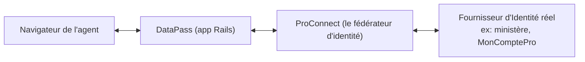
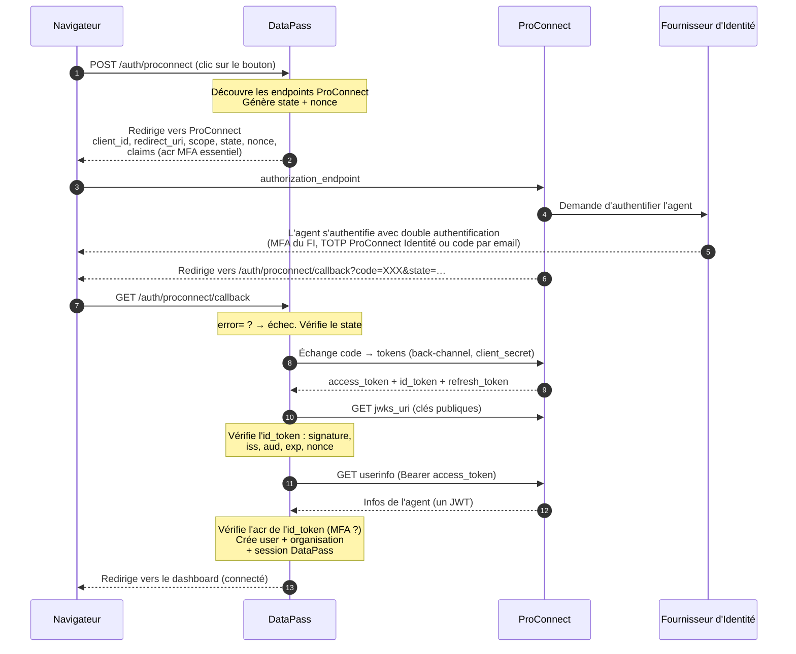
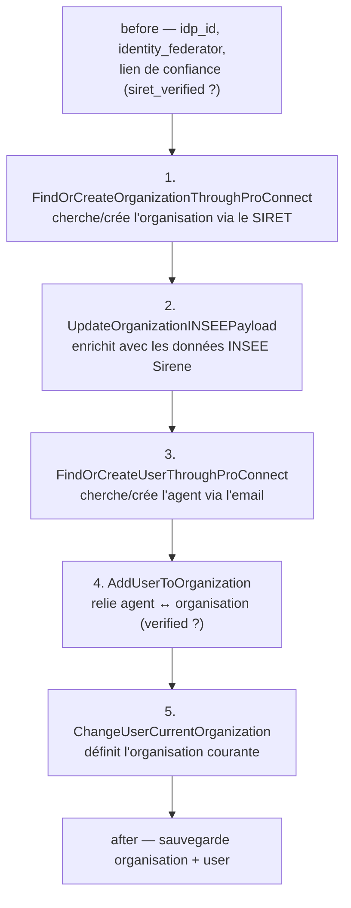
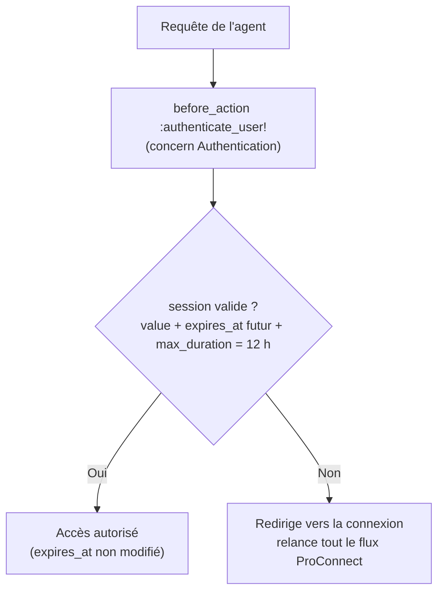
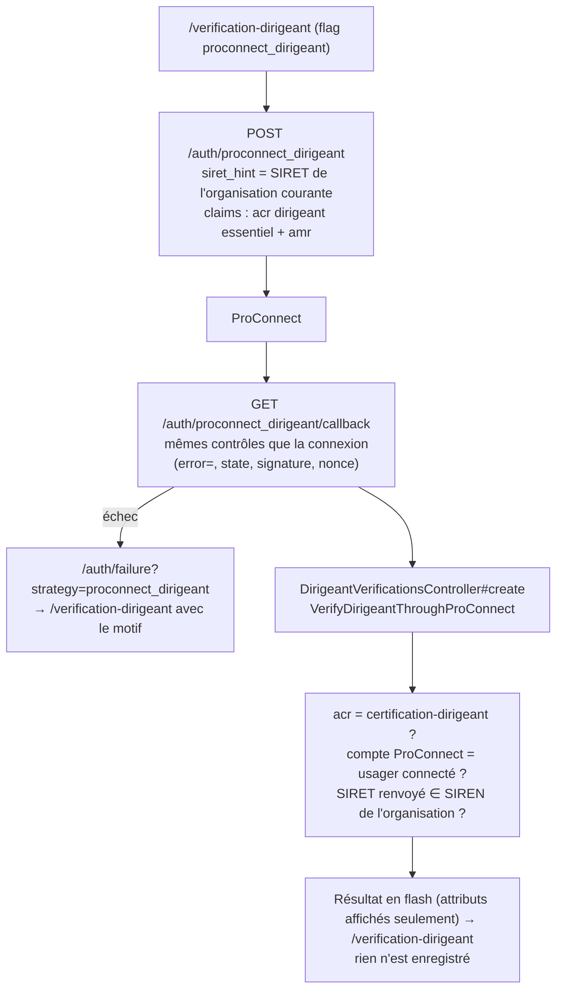
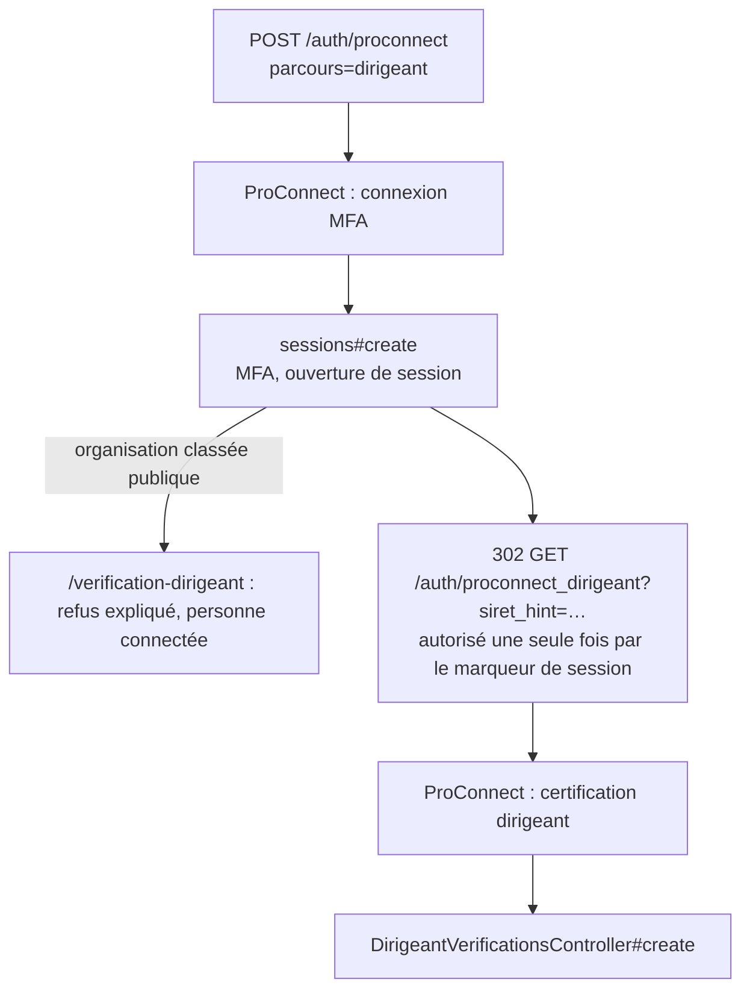
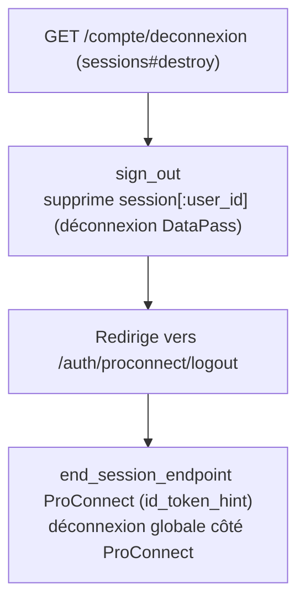

# Authentification des agents via ProConnect

Ce document décrit le processus complet d'authentification d'un agent sur DataPass.
Il couvre le flux ProConnect (actuel), la chaîne de traitement côté DataPass, la gestion
de session, la déconnexion, les mécanismes de sécurité, et le provider legacy MonComptePro.

> Ce document se lit à deux niveaux. La section **« Le principe en bref »** ci-dessous donne
> une vue d'ensemble accessible sans connaissance technique. Les sections suivantes entrent
> dans le détail du code et s'adressent aux développeurs. Un **glossaire** est disponible en
> fin de page.

## Le principe en bref

DataPass ne gère pas lui-même l'authentification des agents : il la délègue entièrement à
ProConnect. ProConnect joue le rôle de fédérateur d'identité — une porte d'entrée unique qui
s'appuie, selon l'agent, sur le fournisseur d'identité adéquat (l'annuaire de son ministère,
ProConnect-Identité pour les agents sans annuaire dédié, etc.), choisi d'après le domaine de
son email.

Le déroulé est le suivant :

- L'agent demande à se connecter à DataPass, qui le redirige vers ProConnect.
- ProConnect vérifie son identité auprès du bon fournisseur. Lorsque ce fournisseur impose une
  double authentification, DataPass s'assure qu'elle a bien eu lieu et la réclame activement si
  ProConnect ne l'a pas déjà appliquée. DataPass ne voit jamais le mot de passe de l'agent.
- Une fois l'agent authentifié, ProConnect renvoie à DataPass une preuve d'identité, que
  DataPass échange en arrière-plan contre les informations de l'agent : nom, email, et surtout
  le SIRET de l'organisation où il travaille.
- DataPass en déduit trois choses : qui est l'agent, dans quelle organisation il travaille, et
  si ce lien peut être considéré comme vérifié. Il ouvre alors une session applicative courte,
  alignée sur ProConnect.
- La session suit un modèle à **plafond absolu de 12 h** : `expires_at` est fixé à la connexion
  (`signed_in_at + 12 h`) et n'est jamais prolongé. Au-delà de 12 h — ou après une déconnexion
  — le parcours complet recommence. Cet alignement sur les 12 h de ProConnect réduit la fenêtre
  d'exposition (poste partagé, cookie volé).

Les sections suivantes détaillent l'implémentation de ce parcours.

## Vue d'ensemble


```mermaid
flowchart LR
    N["Navigateur de l'agent"] <--> DP["DataPass (app Rails)"]
    DP <--> PC["ProConnect (le fédérateur d'identité)"]
    PC <--> FI["Fournisseur d'Identité réel<br/>ex: ministère, MonComptePro"]
```

Idée centrale : **DataPass ne gère aucun mot de passe.** Il délègue la preuve d'identité à
ProConnect, qui est un *fédérateur* : un seul bouton « ProConnect » côté DataPass, mais
plusieurs fournisseurs d'identité (FI) derrière (l'IdP d'un ministère, ProConnect-Identité
ex-MonComptePro pour les agents sans IdP dédié, etc.). ProConnect choisit le bon FI selon le
domaine de l'email de l'agent.

Le protocole est **OpenID Connect (OIDC)**, dans sa variante « Authorization Code Flow ».

## Première connexion


```mermaid
sequenceDiagram
    autonumber
    participant N as Navigateur
    participant DP as DataPass
    participant PC as ProConnect
    participant FI as Fournisseur d'Identité

    N->>DP: POST /auth/proconnect (clic sur le bouton)
    Note over DP: Découvre les endpoints ProConnect<br/>Génère state + nonce
    DP-->>N: Redirige vers ProConnect<br/>client_id, redirect_uri, scope, state, nonce,<br/>claims (acr MFA essentiel)
    N->>PC: authorization_endpoint
    PC->>FI: Demande d'authentifier l'agent
    FI-->>N: L'agent s'authentifie avec double authentification<br/>(MFA du FI, TOTP ProConnect Identité ou code par email)
    PC-->>N: Redirige vers /auth/proconnect/callback?code=XXX&state=…
    N->>DP: GET /auth/proconnect/callback
    Note over DP: error= ? → échec. Vérifie le state
    DP->>PC: Échange code → tokens (back-channel, client_secret)
    PC-->>DP: access_token + id_token + refresh_token
    DP->>PC: GET jwks_uri (clés publiques)
    Note over DP: Vérifie l'id_token : signature,<br/>iss, aud, exp, nonce
    DP->>PC: GET userinfo (Bearer access_token)
    PC-->>DP: Infos de l'agent (un JWT)
    Note over DP: Vérifie l'acr de l'id_token (MFA ?)<br/>Crée user + organisation<br/>+ session DataPass
    DP-->>N: Redirige vers le dashboard (connecté)
```

Étapes détaillées :

1. **Départ.** L'agent clique sur le bouton (`_pro_connect.html.erb` →
   `POST /auth/proconnect`). La gem `omniauth-proconnect` intercepte cette route. Elle
   interroge ProConnect pour découvrir ses endpoints (`discover_endpoint!` sur
   `.well-known/openid-configuration`), génère un `state` et un `nonce` stockés en session.
2. **Redirection.** La gem renvoie le navigateur vers l'`authorization_endpoint` de
   ProConnect avec `client_id`, `redirect_uri`, `scope`, `state`, `nonce`, et un paramètre
   `claims` qui exige une double authentification (voir « La double authentification
   obligatoire » plus bas).
3. **Authentification chez ProConnect.** L'agent choisit son organisation, s'authentifie, puis
   valide sa double authentification. DataPass ne voit rien de cette étape.
4. **Retour avec un code.** ProConnect renvoie le navigateur vers
   `/auth/proconnect/callback` avec un `code` à usage unique et le `state`. Si ProConnect
   renvoie un paramètre `error` à la place du `code` (usager qui abandonne, erreur côté
   ProConnect), DataPass s'arrête là, sans tenter d'échange. Sinon, il vérifie que le `state`
   correspond à celui qu'il avait émis (`valid_state?`).
5. **Échange code → tokens (back-channel).** Le `code` seul est inutile. DataPass rappelle
   ProConnect **de serveur à serveur** (le navigateur n'est pas dans la boucle), avec son
   `client_secret`, pour échanger le code contre des tokens (`access_token`, `id_token`,
   `refresh_token`). Seul l'`id_token` est gardé en session (`omniauth.pc.id_token`), pour
   l'`id_token_hint` de la déconnexion : l'`access_token` ne sert qu'au `userinfo` de ce retour et
   reste en mémoire, le `refresh_token` est ignoré. La session tient dans un cookie de 4 Ko, et un
   jeton y coûte environ deux fois sa taille (chiffrement puis encodage). L'`id_token` est ensuite vérifié
   (`verified_id_token_claims`) : signature avec les clés publiées sur le `jwks_uri` de la
   découverte, en RS256. **Temporairement**, HS256 est aussi accepté, vérifié avec notre
   `client_secret` seulement : l'application ProConnect de production signe en HS256, et seul le
   support ProConnect peut la passer en RS256. Chaque algorithme a sa clé (jamais une clé publique
   comme secret HMAC), et l'algorithme reçu est journalisé à chaque connexion
   (`[ProConnect] id_token signed with …`), pour voir quand la production bascule. Le commit qui
   accepte HS256 est à annuler à ce moment-là. Tout autre algorithme est refusé (`invalid_id_token`,
   avec l'algorithme reçu dans le message remonté à Sentry). Émetteur (`iss`) égal à celui de la découverte, audience
   (`aud`) contenant notre `client_id`, expiration (`exp`) future à 10 secondes près (tolérance
   d'horloge), et `nonce` égal à celui de la session (supprimé après usage).
6. **Récupération des infos agent.** DataPass appelle le `userinfo_endpoint` avec
   l'`access_token`. Particularité ProConnect : la réponse est un **JWT** (jeton signé), pas
   du JSON brut. Il est décodé dans `@userinfo`. Claims utiles : `sub` (identifiant unique),
   `email`, `given_name`, `usual_name`, `siret`, `idp_id` (quel FI a servi), `phone_number`.
   Le `sub` de userinfo doit être celui de l'`id_token`. L'`acr` et l'`amr` de l'`id_token`
   vérifié sont exposés à côté, dans `extra.acr` et `extra.amr` du hash OmniAuth.

Chaque contrôle qui échoue appelle `fail!` avec un motif (`proconnect_error`, `csrf_detected`,
`token_exchange_failed`, `invalid_id_token`). `OmniAuth::FailureReporter` journalise le motif,
l'envoie à Sentry en `warning`, puis redirige vers `/auth/failure` (`sessions#failure`).
7. **Construction côté DataPass.** Voir la section suivante.

## Traitement côté DataPass (étape 7)

Le `SessionsController#create` reçoit le callback OmniAuth, aiguille vers
`create_from_proconnect`, vérifie la double authentification (voir plus bas), puis appelle l'organizer
`AuthenticateUserThroughProConnect` :


```mermaid
flowchart TD
    B["before — idp_id, identity_federator,<br/>lien de confiance (siret_verified ?)"]
    B --> S1["1. FindOrCreateOrganizationThroughProConnect<br/>cherche/crée l'organisation via le SIRET"]
    S1 --> S2["2. UpdateOrganizationINSEEPayload<br/>enrichit avec les données INSEE Sirene"]
    S2 --> S3["3. FindOrCreateUserThroughProConnect<br/>cherche/crée l'agent via l'email"]
    S3 --> S4["4. AddUserToOrganization<br/>relie agent ↔ organisation (verified ?)"]
    S4 --> S5["5. ChangeUserCurrentOrganization<br/>définit l'organisation courante"]
    S5 --> A["after — sauvegarde organisation + user"]
```

Trois objets distincts en sortent : **qui** est l'agent (User, via email), **où** il travaille
(Organization, via SIRET enrichi INSEE), et le **lien de confiance** entre les deux (`verified`
ou non, selon le FI).

À chaque connexion, `FindOrCreateUserThroughProConnect` resynchronise le nom (`usual_name`), le
prénom (`given_name`) et le téléphone (`phone_number`) de l’agent, **seulement quand le FI les
transmet** : une valeur vide ou absente laisse en place celle déjà connue du compte (certains FI
fédérés, comme celui de la CNAM, ne transmettent pas le téléphone). Le poste (`job_title`) n’est
jamais fourni par ProConnect et n’est donc pas touché. La chaîne MonComptePro applique la même
règle, poste compris.

Le controller appelle ensuite `sign_in`, qui crée la **session applicative DataPass**. La logique
de cycle de vie est isolée dans le concern `Authentication::SessionLifecycle` (durée, validation,
rotation). Au login, `rotate_session` régénère l'identifiant de session (protection
contre la *fixation de session*) tout en préservant l'`id_token` ProConnect (`omniauth.pc.id_token`) et le
chemin de retour. La session porte un unique plafond absolu : `expires_at` fixé à la connexion
(`SESSION_MAX_DURATION = 12.hours`) :

```ruby
rotate_session

session[:user_id] = {
  value: user.id,
  expires_at: SESSION_MAX_DURATION.from_now,
  max_duration: SESSION_MAX_DURATION.to_i,
  identity_federator:,
  identity_provider_uid:,
}
```

Enfin, si le FI a `choose_organization_on_sign_in?` à vrai (agent multi-organisations), DataPass
redirige vers la page de choix d'organisation (`user_organizations_path`). Sinon, direction le
dashboard.

## Connexions suivantes : ProConnect n'est plus sollicité


```mermaid
flowchart TD
    A["Requête de l'agent"] --> B["before_action :authenticate_user!<br/>(concern Authentication)"]
    B --> C{"session valide ?<br/>value + expires_at futur + max_duration = 12 h"}
    C -- Oui --> D["Accès autorisé<br/>(expires_at non modifié)"]
    C -- Non --> E["Redirige vers la connexion<br/>relance tout le flux ProConnect"]
```

Une fois connecté, DataPass vit sur **sa propre session** (cookie chiffré, plafond absolu de
12 h). À chaque requête authentifiée, `expires_at` est vérifié mais jamais prolongé : un seul
timer fixe depuis la connexion. Un ancien cookie sans marqueur `max_duration` valide (cookie
antérieur à DP-1820) est rejeté → reconnexion douce (re-clic silencieux si la session ProConnect
est encore active). DataPass ne
rappelle pas ProConnect à chaque page ; ProConnect ne sert qu'à prouver l'identité au moment du
login.

> **DP-1820** a simplifié le modèle introduit par DP-1789 : l'ancien mécanisme de fenêtre
> glissante (`slide_session_expiry`) et le plafond secondaire de 24 h (`SESSION_ABSOLUTE_TIMEOUT`,
> `absolute_expires_at`) sont supprimés. Il reste un seul timer absolu : `expires_at`.

Il y a donc **deux sessions distinctes** :

- les **tokens ProConnect** (`omniauth.pc.*`) — utilisés au login et conservés surtout pour la
  déconnexion globale ;
- la **session applicative DataPass** (`session[:user_id]`) — c'est elle qui maintient l'agent
  connecté (plafond absolu 12 h depuis la connexion, sans prolongation par l'activité).

## Mécanismes de sécurité

**Le `state` — éviter qu'une connexion soit détournée.**
Au moment d'envoyer l'agent vers ProConnect, DataPass génère un identifiant aléatoire propre à
cette tentative de connexion, le conserve dans la session et le transmet à ProConnect, qui le
renvoie inchangé. Au retour, DataPass vérifie que les deux correspondent (`valid_state?`). Sans
ce contrôle, un tiers pourrait forger une réponse d'authentification et la faire traiter par le
navigateur de la victime (attaque CSRF) ; le `state` garantit que la réponse traitée répond bien
à une demande émise depuis ce navigateur. En cas de différence, la connexion est rejetée.

**Le `nonce` — empêcher la réutilisation d'un ancien jeton.**
DataPass insère un second identifiant aléatoire dans la demande ; ProConnect le réinscrit à
l'intérieur de l'`id_token` qu'il délivre. DataPass vérifie ainsi que le jeton reçu a bien été
émis pour cette demande précise, et non rejoué à partir d'un échange antérieur intercepté. Là où
le `state` protège l'aller-retour de la requête, le `nonce` protège le contenu du jeton. Le
`nonce` n'est utilisable qu'une fois : il est retiré de la session dès sa vérification.

**La signature de l'`id_token` — fonder un droit sur un jeton authentique.**
La documentation ProConnect impose de vérifier la signature de l'`id_token` avant de lire ses
claims. La gem ne le fait pas : la sous-classe `OmniAuth::Strategies::DataPassProconnect`
(`lib/omniauth/strategies/data_pass_proconnect.rb`), déclarée à la place de la stratégie de la gem
sous le même nom `proconnect`, récupère les clés publiques de ProConnect (`jwks_uri`) à chaque retour et rejette tout jeton
non signé, signé par une autre clé, émis pour une autre application, par un autre émetteur ou
expiré. Avant novembre 2026 (DPP-202), l'`acr` de la double authentification était lu sans cette
vérification.

Un interrupteur permet de couper **la seule vérification de signature** sans redéployer, si
ProConnect venait à signer autrement (algorithme autre que RS256, clés JWKS indisponibles) et
bloquait ainsi toutes les connexions : le réglage `proconnect_id_token_signature_check`
(`Setting`, ou variable `PROCONNECT_ID_TOKEN_SIGNATURE_CHECK`), actif sauf s'il vaut `false`.
Coupé, l'`id_token` est décodé sans vérifier la signature, comme avant DPP-202, mais `iss`,
`aud`, `exp`, `nonce`, le `state` et la cohérence du `sub` restent contrôlés. C'est une
roue de secours : le remettre à `true` dès que la cause est corrigée.

**La double authentification obligatoire — pour tous les agents.**
(Janvier 2026 : réservée aux agents MonComptePro via un aller-retour de réauthentification ;
octobre 2026 : étendue à tous, DPP-166.) Dès la requête d'autorisation, DataPass réclame à
ProConnect un `acr` MFA comme claim essentiel de l'`id_token` :
`claims={"id_token":{"acr":{"essential":true,"values":["eidas0-mfa","eidas1-mfa","eidas2","eidas3"]}}}`
(`MFA_ACR_VALUES`, `requested_claims`). ProConnect fait alors faire le second facteur à l'agent : le
MFA de son fournisseur d'identité s'il en a un, le TOTP pour ProConnect Identité, sinon un code
à usage unique envoyé par email (`eidas1-mfa`).

Au retour, comme l'exige la documentation ProConnect, DataPass vérifie l'`acr` de l'`id_token`
(`extra.acr`, `mfa_performed?`). S'il ne fait pas partie des valeurs MFA — ou s'il est absent —
la connexion est refusée (`reject_sign_in_without_mfa`) : aucune session n'est ouverte, l'agent
revient sur la page d'accueil avec le message recommandé par ProConnect, et l'événement remonte
dans Sentry en `error` (un vrai agent est bloqué, quelqu'un doit regarder). Ce cas se produira
là où ProConnect ne peut pas relayer de code par email : services sur le RIE, et tout le monde
après la fin du relais email, le 28/02/2027.

Référence : https://partenaires.proconnect.gouv.fr/docs/fournisseur-service/double_authentification

> Repère : `acr` (*Authentication Context Class Reference*) = le niveau de garantie atteint ;
> les valeurs suffixées `-mfa`, `eidas2` et `eidas3` attestent d'un second facteur.

**La rotation de session — empêcher la fixation de session.**
Au moment du login (`sign_in`), DataPass régénère l'identifiant de session (`rotate_session` →
`reset_session`) pour qu'un identifiant éventuellement connu d'un attaquant avant authentification
ne donne aucun accès après. Les clés strictement nécessaires sont préservées : l'`id_token`
ProConnect (`omniauth.pc.id_token`, indispensable au logout global) et `return_to_after_sign_in`. Le plafond absolu de 12 h complète ce durcissement en
réduisant la fenêtre d'exploitation d'un cookie volé.

**La durée de session courte — réduire la fenêtre d'exposition.**
L'ordre des contrôles dans `authenticate_user!` est volontaire : validité de session, puis
bannissement (`BannedUserError`), puis `return` — pour ne jamais autoriser l'accès d'un agent
banni. Limites de ce palier *stateless* (cookie store, sans store serveur) : pas de révocation à
distance ni de « déconnecter partout », un cookie volé reste valide jusqu'à son expiration (12 h).
Ces points seront traités par **DP-1790** (store serveur révocable).

## Vérification du statut de dirigeant (DPP-202)

ProConnect peut certifier qu'un usager est dirigeant d'une entreprise : il rapproche son identité
FranceConnect de la liste des dirigeants issue de Sirene et du RNE, pour le SIREN de
l'organisation choisie. La seule preuve renvoyée est l'`acr`
`https://proconnect.gouv.fr/assurance/certification-dirigeant`.

DataPass l'utilise par une **seconde stratégie OmniAuth**, `proconnect_dirigeant`
(`lib/omniauth/strategies/proconnect_dirigeant.rb`), lancée par un usager **déjà connecté** :


```mermaid
flowchart TD
    A["/verification-dirigeant (flag proconnect_dirigeant)"] --> B["POST /auth/proconnect_dirigeant<br/>siret_hint = SIRET de l'organisation courante<br/>claims : acr dirigeant essentiel + amr"]
    B --> C["ProConnect"]
    C --> D["GET /auth/proconnect_dirigeant/callback<br/>mêmes contrôles que la connexion<br/>(error=, state, signature, nonce)"]
    D -- échec --> F["/auth/failure?strategy=proconnect_dirigeant<br/>→ /verification-dirigeant avec le motif"]
    D --> E["DirigeantVerificationsController#create<br/>VerifyDirigeantThroughProConnect"]
    E --> G["acr = certification-dirigeant ?<br/>compte ProConnect = usager connecté ?<br/>SIRET renvoyé ∈ SIREN de l'organisation ?"]
    G --> H["Résultat en flash (attributs affichés seulement) → /verification-dirigeant<br/>rien n'est enregistré"]
```

- **Pas de déconnexion ni de rotation de session** : le callback dédié n'ouvre pas de session.
  La route générique `auth/:provider/callback` est restreinte à `proconnect` et
  `mon_compte_pro`, pour qu'un retour dirigeant ne puisse jamais passer par `sessions#create`.
- **Session de connexion intacte** : la stratégie range `state` et `nonce` sous
  `omniauth.pc_dirigeant.*` et ne stocke pas ses jetons en session. L'`id_token` de la connexion,
  qui sert à la déconnexion, n'est pas écrasé. Elle n'a pas de chemin `/logout`.
- **Configuration** : la stratégie utilise l'application ProConnect de la connexion
  (`ProConnectConfig`). L'URL de retour `<host>/auth/proconnect_dirigeant/callback`
  (`ProConnectConfig.dirigeant_redirect_uri`) doit être déclarée sur cette application.
- **Rapprochement du compte** : les deux parcours passant par la même application, le `sub`
  renvoyé est le même : `CheckProConnectDirigeantIdentity` le compare à `users.external_id`.
- **Limites connues** : ProConnect ne transmet pas la cause d'un refus (`error=invalid_request`
  même pour une organisation non couverte) ; l'application d'intégration refuse les agents du
  secteur privé (`Y500015`, case réglée par ProConnect, à changer sur demande par le formulaire
  « Modifier votre configuration »). L'application de production n'a pas cette restriction : le
  secteur privé peut déjà s'y connecter. La persistance du statut relève de DPP-201/206.

### Connexion par le bouton « ProConnect dirigeant »

ProConnect ne sait demander qu'un `acr` à la fois : soit la double authentification, soit la
certification dirigeant. Le parcours dirigeant enchaîne donc deux cinématiques sans repasser par
une page DataPass :


```mermaid
flowchart TD
    A["POST /auth/proconnect<br/>parcours=dirigeant"] --> B["ProConnect : connexion MFA"]
    B --> C["sessions#create<br/>MFA, ouverture de session"]
    C -- organisation classée publique --> R["/verification-dirigeant : refus expliqué, personne connectée"]
    C --> D["302 GET /auth/proconnect_dirigeant?siret_hint=…<br/>autorisé une seule fois par le marqueur de session"]
    D --> E["ProConnect : certification dirigeant"]
    E --> F["DirigeantVerificationsController#create"]
```

- Le paramètre `parcours=dirigeant` revient au callback par `env['omniauth.params']`.
- Le flag `proconnect_dirigeant` est ouvert partout sauf en production, où il suit le Setting
  `proconnect_dirigeant_open` (type `:enabled_if_true`, coupé par défaut, repli sur la variable
  `PROCONNECT_DIRIGEANT_OPEN`). L'ouvrir ne demande ni déploiement ni redémarrage :
  `Setting.set(:proconnect_dirigeant_open, 'true')`, et `Setting.unset` pour refermer.
- Le flag ne garde que les points d'entrée visibles : la page `/verification-dirigeant`
  (404 flag fermé) et les boutons qui mènent au parcours. La stratégie OmniAuth
  `proconnect_dirigeant` et la lecture de `parcours=dirigeant` ne le consultent pas : sans bouton,
  personne n'y arrive, et l'application ProConnect de production refuse une URL de retour qu'on
  ne lui a pas déclarée.
- Le départ d'OmniAuth n'accepte que le POST avec jeton CSRF (`omniauth-rails_csrf_protection`).
  Pour enchaîner par une redirection, `ProconnectDirigeant#request_call?` accepte aussi un GET, à
  condition que `sessions#create` ait posé le marqueur
  `omniauth.pc_dirigeant.chained_request` juste après la connexion. Le marqueur est l'heure de la
  connexion : il est consommé au premier usage et n'est plus accepté au-delà de deux minutes
  (`CHAINED_REQUEST_TTL`), pour qu'un lien externe suivi plus tard ne lance pas la certification
  sans POST. Un GET hors enchaînement tombe en 404.
- Si l'entreprise certifiée n'est pas celle de la connexion (`siret_outside_siren`), la page
  l'explique et propose de relancer la vérification. Pas de bascule automatique d'organisation.
- Le paramètre `return_to`, posé sur l'un ou l'autre formulaire de départ, suit la connexion,
  l'enchaînement et le retour de ProConnect (`env['omniauth.params']`). Après la certification,
  `DirigeantVerificationsController#create` y renvoie la personne, avec le résultat dans
  `flash[:dirigeant_verification]`. Un échec renvoyé par ProConnect (annulation, structure non
  certifiable) y ramène aussi : `OmniAuth::FailureReporter` recopie `return_to` dans
  `omniauth.origin`, que la `FailureEndpoint` transmet à `sessions#failure` (`origin`). Seul un
  chemin local est suivi (pas de `//`, de `\` ni d'hôte, `LocalReturnPath`) ; sinon, la personne
  arrive sur `/verification-dirigeant`. Le statut n'étant pas conservé, la page d'arrivée devra
  revérifier à la soumission que la personne est toujours dirigeante (DPP-206).

### Secteur de l'organisation

La connexion ne contrôle pas le secteur : elle ne refuse personne et ne signale rien à Sentry.
Le secteur se contrôle au moment de l'action qui l'exige, dans sa policy.

- `PublicSectorClassification.new(organization)` lit le payload INSEE déjà en base, sans appel
  externe. Il répond `public?`, `private?` et `known?`. Sans catégorie juridique, le secteur est
  inconnu : ni public, ni privé. `public?` s'écrit comme la règle : secteur connu, SIREN absent des
  `never_public_sirens`, unité légale active, et SIREN présent dans les `always_public_sirens` ou
  catégorie juridique publique.
- La règle est celle de ProConnect (`computeServicePublicInfo` du paquet
  `@proconnect-gouv/proconnect.identite`) et de l'Annuaire des Entreprises, avec les listes
  recopiées dans `config/public_sector_classification.yml` (78 catégories juridiques, SIREN
  toujours publics et SIREN jamais publics, commit source indiqué dans le fichier). Les listes
  blanche et noire de ProConnect y deviennent `always_public_sirens` et `never_public_sirens`,
  nommées par leur effet. La liste des SIREN toujours publics écarte une ligne du
  Grist mal saisie (`77566343803654.0`, un SIRET passé en nombre), qu'aucun SIREN ne peut faire
  correspondre, ni chez ProConnect ni chez nous.
- Pas d'exception pour le RIE : ProConnect y accorde le rôle `agent_public` d'office, mais ce
  rôle n'est pas exploitable par les fournisseurs de service. La règle s'applique donc partout.
- Une policy ne refuse que sur une information connue et contraire. `OrganizationPolicy#start_dirigeant_verification?`
  refuse la certification dirigeant à une organisation classée publique, et la laisse passer
  quand le secteur est inconnu. La page `/verification-dirigeant` explique alors le refus
  (`organization_is_public_service`) sans proposer le bouton, la connexion par le parcours
  dirigeant y ramène la personne, toujours connectée, sans lancer l'aller-retour ProConnect, et le
  retour de ProConnect est refusé de la même façon. C'est la soumission (DPP-211) qui exigera un
  secteur connu.
- À la connexion, les données INSEE ne sont pas attendues : `UpdateOrganizationINSEEPayload`
  met en file leur rafraîchissement quand elles manquent ou datent de plus de 24 heures. Tant
  qu'aucun appel n'a abouti, `known?` reste faux.
- Le statut de dirigeant ne se déduit ni du paramètre `parcours` (libre, posé par le formulaire
  de départ) ni de la connexion : une entreprise privée qui choisit `parcours=dirigeant` est
  connectée avant la certification, et le reste si elle l'abandonne ou si elle échoue. Chaque
  action qui suppose le statut vérifie elle-même une certification réussie et encore valide
  (DPP-206 pour le registre). DPP-202 n'expose aucune action de ce type, seulement l'affichage du
  résultat.

## Validation partagée avec Rails Pulse

Le tableau de bord Rails Pulse (`/rails_pulse`) est réservé aux admins. Pour vérifier la
session, il réutilise le même prédicat que l'app : `Authentication::SessionLifecycle.valid_session?`
(voir `config/initializers/rails_pulse.rb`). Une seule logique de validation, pas de doublon.

## Déconnexion


```mermaid
flowchart TD
    A["GET /compte/deconnexion (sessions#destroy)"] --> B["sign_out<br/>supprime session[:user_id] (déconnexion DataPass)"]
    B --> C["Redirige vers /auth/proconnect/logout"]
    C --> D["end_session_endpoint ProConnect (id_token_hint)<br/>déconnexion globale côté ProConnect"]
```

L'`id_token_hint` est l'`id_token` gardé en session à la connexion. Il n'y est écrit qu'une fois
tous les contrôles du retour passés : un retour refusé laisse intact le jeton de la personne déjà
connectée. La stratégie dirigeant n'écrit jamais cette clé.

## Provider legacy MonComptePro

Un second provider existe dans `config/initializers/omniauth.rb` : `mon_compte_pro` (l'ancêtre,
AgentConnect/MonComptePro, aujourd'hui ProConnect Identité interrogé en direct, hors fédération
ProConnect). Il ne sert plus à se connecter : il ne reste que pour changer d'organisation avec
le prompt `select_organization`, que la fédération ProConnect ne propose pas encore. Les boutons
« Rejoindre une autre organisation » (`user/organizations/index`, agents ProConnect Identité) et
« Changer d'organisation » (`authorization_requests/closed_organization`) l'utilisent.

Comme ce provider ne passe pas par la double authentification ProConnect, son callback n'ouvre
jamais de session. `SessionsController#create_from_mon_compte_pro` exige :

- un agent déjà connecté, via ProConnect (`identity_federator` de la session à `proconnect`) ;
- le même email côté MonComptePro que celui de l'agent connecté.

Si c'est le cas, `ChangeCurrentOrganizationThroughMonComptePro` change l'organisation courante
(lien vérifié, « from MonComptePro identity ») et la session ProConnect est conservée. Sinon :
message d'erreur, `Sentry.capture_message` en `warning`, redirection vers l'accueil.

`AuthenticateUserThroughMonComptePro` et `FindOrCreateUserThroughMonComptePro` n'ont plus
d'appelant ; leur retrait, avec celui du provider, attend que ProConnect propose le choix
d'organisation.

## En une phrase

ProConnect prouve l'identité une fois (OIDC code flow) ; DataPass en tire trois objets — agent,
organisation, lien de confiance — puis vit sur sa propre session courte (plafond absolu 12 h
depuis la connexion, sans prolongation par l'activité).

## Fichiers de référence

| Rôle | Fichier |
|---|---|
| Config des providers, scopes | `config/initializers/omniauth.rb` |
| Contrôles du retour ProConnect, MFA demandée | `lib/omniauth/strategies/data_pass_proconnect.rb` |
| Signalement des échecs OmniAuth | `lib/omniauth/failure_reporter.rb` |
| Stratégie de vérification du dirigeant | `lib/omniauth/strategies/proconnect_dirigeant.rb` |
| Contrôles du statut de dirigeant | `app/organizers/verify_dirigeant_through_pro_connect.rb` |
| Page de vérification du dirigeant | `app/controllers/dirigeant_verifications_controller.rb` |
| Secteur d'une organisation | `app/services/public_sector_classification.rb` (règle) |
| Listes du secteur public | `app/services/public_sector_lists.rb` + `config/public_sector_classification.yml` |
| Refus de la certification dirigeant au secteur public | `app/policies/organization_policy.rb` (`start_dirigeant_verification?`) |
| Gem du flux OIDC ProConnect | `omniauth-proconnect` (`lib/omniauth/proconnect.rb`) |
| Routes auth | `config/routes.rb` (`auth/:provider/callback`, `compte/deconnexion`) |
| Bouton de connexion | `app/views/pages/shared/unauthenticated_pages/_pro_connect.html.erb` |
| Aiguillage du callback, MFA, logout | `app/controllers/sessions_controller.rb` |
| Session applicative (sign_in/out) | `app/controllers/concerns/authentication.rb` |
| Cycle de vie de session (durée, validation, rotation) | `app/controllers/concerns/authentication/session_lifecycle.rb` |
| Organizer ProConnect | `app/organizers/authenticate_user_through_pro_connect.rb` |
| Organisation depuis le SIRET | `app/interactors/find_or_create_organization_through_pro_connect.rb` |
| Enrichissement INSEE | `app/interactors/update_organization_insee_payload.rb` |
| User depuis l'email | `app/interactors/find_or_create_user_through_pro_connect.rb` |
| Lien agent ↔ organisation | `app/interactors/add_user_to_organization.rb` |
| Organisation courante | `app/interactors/change_user_current_organization.rb` |
| Caractéristiques d'un FI | `app/models/identity_provider.rb` + `config/identity_providers.yml` |
| Provider legacy (changement d'organisation) | `app/organizers/change_current_organization_through_mon_compte_pro.rb` |

## Glossaire

| Terme | En clair |
|---|---|
| **ProConnect** | Le service de l'État qui authentifie les agents publics pour le compte de nombreuses applications. DataPass lui délègue entièrement la connexion. |
| **Fournisseur d'identité (FI)** | Le service qui détient et vérifie réellement l'identité de l'agent (annuaire d'un ministère, ProConnect-Identité…). ProConnect choisit le bon selon l'email de l'agent. |
| **OIDC (OpenID Connect)** | Le protocole standard d'authentification déléguée utilisé entre DataPass et ProConnect pour échanger une preuve d'identité de façon sécurisée. |
| **Fédérateur d'identité** | Un intermédiaire qui regroupe plusieurs fournisseurs d'identité derrière une seule porte d'entrée. ProConnect en est un. |
| **Token (jeton)** | Une donnée signée délivrée par ProConnect qui atteste que l'agent a été authentifié et permet à DataPass de récupérer ses informations. |
| **Scope** | La liste des informations que DataPass a le droit de demander sur l'agent (nom, email, SIRET…). |
| **SIRET** | Le numéro qui identifie officiellement l'organisation (l'employeur) de l'agent. DataPass s'en sert pour reconnaître l'organisation. |
| **INSEE Sirene** | Le registre officiel des entreprises et administrations. DataPass y récupère les informations détaillées d'une organisation à partir de son SIRET. |
| **Session** | L'état de connexion maintenu par DataPass après authentification (plafond absolu 12 h depuis la connexion, sans prolongation), qui évite de repasser par ProConnect à chaque page. |
| **MFA (double authentification)** | Une vérification supplémentaire (code sur téléphone, application, code reçu par email…) en plus du mot de passe. DataPass l'exige pour tous les agents qui se connectent via ProConnect. |
| **Back-channel** | Un échange direct de serveur à serveur entre DataPass et ProConnect, sans passer par le navigateur de l'agent — donc non exposé côté client. |
| **state / nonce** | Deux identifiants aléatoires générés par DataPass pour s'assurer que la réponse reçue de ProConnect est authentique et n'est pas rejouée. |
